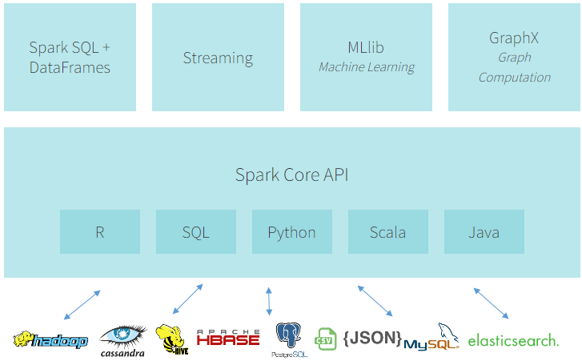
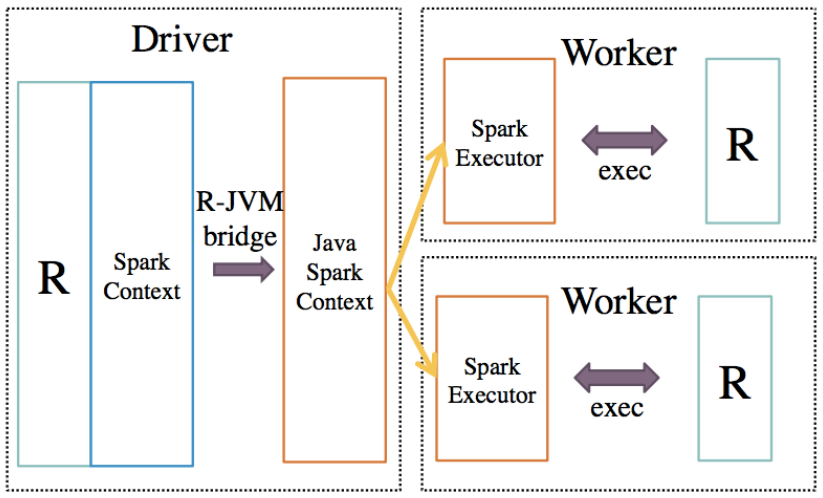
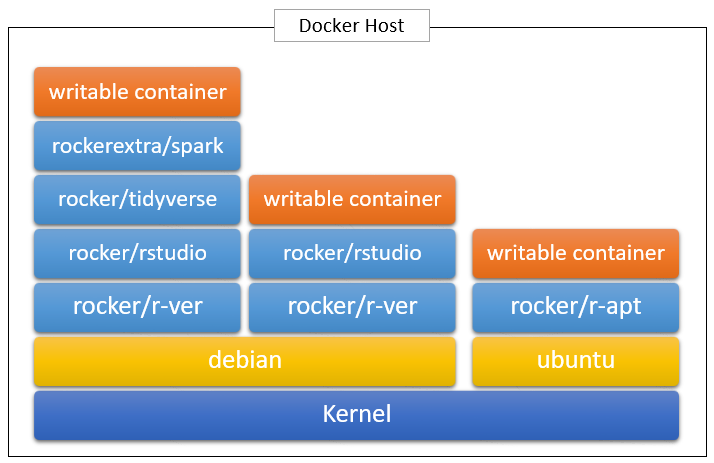
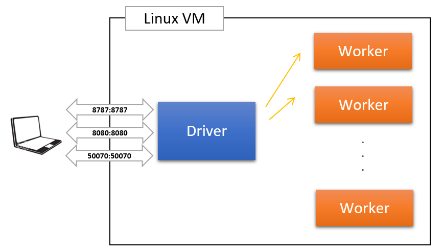

```{r setup, include=FALSE, warning=FALSE, message=FALSE}
knitr::opts_chunk$set(fig.width=10, fig.height=4, fig.align='center') 

library(ggplot2)
library(magrittr)
library(tibble)
library(dplyr)
source('utils.R')

dat_s <- readr::read_csv('./flight-present/flight_2007_10p.csv')
hpreds_up <- readr::read_csv('./flight-present/hpreds_up.csv') %>% as.data.frame()
cmat <- readr::read_csv('./flight-present/cmat.csv') %>% as.data.frame()
importance <- readr::read_csv('./flight-present/importance.csv')
```

# Intro to Spark

<p style="text-align:center;">
  
  <br>
  <sub>Source: <a href="https://databricks.com/spark/about">Apache Spark Ecosystem</a></sub>
</p>

- [Apache Spark™](https://spark.apache.org/) is a fast and general engine for large-scale data processing
    + built around speed, ease of use, scalable, fault tolerant ...
- Main focus is Spark SQL, DataFrame and MLlib
    + Spark SQL allows to execute SQL queries or to read data from an existing Hive installation
    + DataFrame is immutable distributed collection of data, organized into named columns
        * conceptually equivalent to a table in a relational database or a data frame in R/Python
        * returned when running SQL from another programming language
    + [ML algorithms since Spark 1.5](https://databricks.com/blog/2015/10/05/generalized-linear-models-in-sparkr-and-r-formula-support-in-mllib.html)

# Intro to SparkR

<p style="text-align:center;">
  
  <br>
  <sub>Source: <a href="https://people.csail.mit.edu/matei/papers/2016/sigmod_sparkr.pdf">SparkR: Scaling R Programs with Spark
</a></sub>
</p>

- Central component of _SparkR_ is a distributed data frame implemented on top of Spark
    + SparkR DataFrames scale to large datasets using Spark's execution engine and relational [query optimizer](https://databricks.com/blog/2015/04/13/deep-dive-into-spark-sqls-catalyst-optimizer.html)
- R to JVM binding on the driver allows R programs to submit jobs to a Spark cluster and support for running R on the Spark executors (workers)

```
Launching java with spark-submit command /usr/local/spark-2.2.1/bin/spark-submit
  sparkr-shell /tmp/RtmpfVHcxh/backend_port37123e7eb08
```

# Intro to Docker

<p style="text-align:center;"></p>

- [Docker](https://docs.docker.com/) is a virtualization tool designed to make it easier to create, deploy, and run applications by using containers
    + Applications can use the same Linux kernel as the host system and ship with things that don't exist on the system - significant performance boost and smaller application size
    + Available on all major OS - some limitations on Windows
    + [Dockerfile](https://github.com/jaehyeon-kim/rocker-extra/blob/3.4.3/spark/Dockerfile) - set of instructions on how to build a Docker image
    + If interested, [The Docker Book](https://www.dockerbook.com/) (ch 1 - 4 and part of ch 7 (docker compose))
- [Rocker project](https://github.com/rocker-org) is a de facto standard of Docker-based application development with R (also in [DockerHub](https://hub.docker.com/r/rocker/))

# Intro to development environment

<p style="text-align:center;"></p>

- [Docker Compose](https://docs.docker.com/compose/overview/) is a tool for defining and running multi-container Docker applications
    + Create: `docker-compose up -d --scale worker=6`
    + Stop: `docker-compose stop`
    + Start: `docker-compose start`
    + Terminate: `docker-compose rm -f` (after stop)
- Note
    + Both RStudio and Spark Cluster are managed by [s6-overlay-builder](https://github.com/just-containers/s6-overlay) project
    + Add AWS credentials in [core-site.xml](https://github.com/jaehyeon-kim/sparkr-demo/blob/master/docker-compose/hadoop-conf/core-site.xml) and copy to `$HADOOP_CONF_DIR`
    + Sources are available in the [project GitHub](https://github.com/jaehyeon-kim/sparkr-demo)

[docker-compose.yml](https://github.com/jaehyeon-kim/sparkr-demo/blob/master/docker-compose/docker-compose.yml)

```
version: "2"

services:
  master:
    build:
        context: .
        dockerfile: Dockerfile-master
    command: /init
    hostname: master
    ports:
      - "6066:6066"
      - "7070:7070"
      - "8080:8080"
      - "50070:50070"
      - "8787:8787"
  worker:
    build:
        context: .
        dockerfile: Dockerfile-worker
    command: /init
    environment:
      SPARK_WORKER_CORES: 1
      SPARK_WORKER_MEMORY: 2g
    links:
      - master
```

[Dockerfile-master](https://github.com/jaehyeon-kim/sparkr-demo/blob/master/docker-compose/Dockerfile-master)

```
FROM rockerextra/spark:3.4.3
MAINTAINER Jaehyeon Kim <dottami@gmail.com>

RUN mkdir -p /etc/services.d/spark-master \
    && echo '#!/usr/bin/with-contenv sh \n /opt/util/bin/start-spark master' > /etc/services.d/spark-master/run

# add AWS credentials
COPY ./hadoop-conf/*.xml $HADOOP_CONF_DIR/
```

[Dockerfile-worker](https://github.com/jaehyeon-kim/sparkr-demo/blob/master/docker-compose/Dockerfile-worker)

```
FROM rockerextra/spark:3.4.3
MAINTAINER Jaehyeon Kim <dottami@gmail.com>

RUN rm -rf /etc/services.d/rstudio \
    && mkdir -p /etc/services.d/spark-worker \
    && echo '#!/usr/bin/with-contenv sh \n /opt/util/bin/start-spark worker master' > /etc/services.d/spark-worker/run

# add AWS credentials
COPY ./hadoop-conf/*.xml $HADOOP_CONF_DIR/
```

# Intro to data manipulation - _load data_

```{r titanic_01, eval=FALSE}
Sys.setenv('JAVA_HOME'='/usr/lib/jvm/java-8-openjdk-amd64')
Sys.setenv('HADOOP_HOME'='/usr/local/hadoop-2.8.2')
Sys.setenv('SPARK_HOME'='/usr/local/spark-2.2.1')

library(magrittr); library(tibble); library(dplyr)
library(SparkR, lib.loc=file.path(Sys.getenv('SPARK_HOME'),'R', 'lib'))
sparkR.session(master = 'spark://master:7077', appName = 'titanic demo',
               sparkConfig = list(spark.driver.memory = '2g'))

tdf <- read.csv('titanic.csv', stringsAsFactors = FALSE) %>%
  dplyr::sample_frac(1, replace = FALSE) %>% as.tibble()
rec <- nrow(tdf)
df <- as.DataFrame(tdf)

df %>% head(2)
  class   age  sex survived
1 third adult male       no
2  crew adult male       no

printSchema(df)
root
 |-- class: string (nullable = true)
 |-- age: string (nullable = true)
 |-- sex: string (nullable = true)
 |-- survived: string (nullable = true)
```

# Intro to data manipulation - _check data_

```{r titanic_02, eval=FALSE}
## more functions
str(df)
'SparkDataFrame': 4 variables:
 $ class   : chr "third" "crew" "first" "first" "second" "crew"
 $ age     : chr "adult" "adult" "adult" "adult" "adult" "adult"
 $ sex     : chr "male" "male" "male" "female" "male" "male"
 $ survived: chr "no" "no" "yes" "yes" "no" "no"

summary(df) %>% collect()
  summary class   age    sex survived
1   count  2201  2201   2201     2201
2    mean  <NA>  <NA>   <NA>     <NA>
3  stddev  <NA>  <NA>   <NA>     <NA>
4     min  crew adult female       no
5     max third child   male      yes

df %>% collect() # SparkDataFrame to data.frame

## check classes
df %>% class() # SparkDataFrame
df %>% head() %>% class() # data.frame
```

# Intro to data manipulation - _select, filter..._

```{r titanic_03, eval=FALSE}
## column expressions
df$survived # Column survived
column('survived') # Column survived
'survived' # string
expr('survived') # Column survived

## selecting rows, columns
df %>% select(df$survived) %>% head()
df %>% select(column('survived')) %>% head()
df %>% select(expr('survived')) %>% head()
df %>% select('class', 'survived') %>% head()

tdf %>% dplyr::select(class, survived) %>% head()

df %>% filter('survived == "yes" and age == "child"') %>% head()
df %>% filter(df$survived == 'yes' & df$age == 'child') %>% head()

tdf %>% dplyr::filter(survived == 'yes' & age == 'child') %>% head()
```

- many function names are same to _dplyr_
    + use `::` for calling them
- expressions are interchangeable but not always - see _dapply_ section
- `expr()` is more expressive - see ML section

# Intro to data manipulation - _group_by, mutate ..._

```{r titanic_04, eval=FALSE}
## creating variable
df %>% mutate(age_c = ifelse(expr('age') == 'adult', '1', '0')) %>% 
  head(2)

  class   age  sex survived age_c
1 third adult male       no     1
2  crew adult male       no     1

## grouping, aggregation
df %>% group_by('class', 'age') %>%
  summarize(count = n(expr('survived'))) %>%
  arrange('class', 'age') %>% collect()

   class   age count                                                            
1   crew adult   885
2  first adult   319
3  first child     6
4 second adult   261
5 second child    24
6  third adult   627
7  third child    79

tdf %>% dplyr::group_by(class, age) %>%
  dplyr::summarise(count = n())
```

# Intro to data manipulation - _join_

```{r titanic_05, eval=FALSE}
rdf <- data.frame(age = c('adult', 'child'), lvl = c('0', '1'), stringsAsFactors = FALSE)
rDF <- as.DataFrame(rdf)

df %>% join(rDF, df$age == rDF$age, 'inner') %>%
  group_by('class', 'lvl') %>%
  summarize(count = n(expr('survived'))) %>%
  arrange('class', 'lvl') %>% collect()

   class lvl count
1   crew   0   885
2  first   0   319
3  first   1     6
4 second   0   261
5 second   1    24
6  third   0   627
7  third   1    79

tdf %>% dplyr::inner_join(rdf, by = 'age') %>%
  dplyr::group_by(class, lvl) %>%
  dplyr::summarise(count = n())
```

* _joinType_
    + default - inner
    + inner, cross, outer, full, full_outer, left, left_outer, right, right_outer, left_semi, or left_anti

# Data manipulation case study

```{r titanic_06, eval=FALSE}
tmp <- df %>% group_by('class', 'age') %>%
  summarize(count = n(expr('survived')))
tmp %>% mutate(prop = expr('count') / rec) %>% 
  arrange('class', 'age') %>% collect()

   class   age count        prop                                                
1   crew adult   885 0.402089959
2  first adult   319 0.144934121
3  first child     6 0.002726034
4 second adult   261 0.118582463
5 second child    24 0.010904134
6  third adult   627 0.284870513
7  third child    79 0.035892776

tdf %>% dplyr::group_by(class, age) %>%
  dplyr::summarise(count = n()) %>% 
  dplyr::mutate(prop = count / rec)
```

- want to obtain _count_ and _prop_ by _class_ and _age_
- unlike _dplyr_, not possible to refer to a column that's created in a chain
    + temporary DF is created
- 4 ways to achieve without a temp DF

# Data manipulation case study - _dapply_

```{r titanic_07, eval=FALSE}
## dapply, dapplyCollect
schema <- structType(
  structField('class', 'string'),
  structField('age', 'string'),
  structField('count', 'double'), # not integer
  structField('prop', 'double')
)

fn <- function(x) {
  cbind(x, x$count / rec) # expr() not working
}

# may take more time but no temporary DF
df %>% group_by('class', 'age') %>%
  summarize(count = n(expr('survived'))) %>%
  dapply(fn, schema) %>%
  arrange('class', 'age') %>% collect()
```

- `dapply()` - apply a function to each partition of a _SparkDataFrame_
- note `expr()`/_string_ don't work in the function
- will be more efficient if applied to a grouped data

# Data manipulation case study - _gapply_

```{r titanic_08, eval=FALSE}
## gapply, gapplyCollect
schema <- structType(
  structField('class', 'string'),
  structField('age', 'string'),
  structField('count', 'integer'),
  structField('prop', 'double')
)

fn <- function(key, x) {
  data.frame(key, nrow(x), nrow(x)/rec, stringsAsFactors = FALSE)
}

df %>% gapply(cols = c('class', 'age'), func = fn, schema = schema) %>%
  arrange('class', 'age') %>% collect()
```

- `dapply()` - apply a function to each partition of a grouped _SparkDataFrame_
- note `nrow()` is not base R function

# Data manipulation case study - _sql_

```{r titanic_09, eval=FALSE}
## sql queries
createOrReplaceTempView(df, 'titanic_tbl')

`%++%` <- function(a, b) paste(a, b)
qry <- '
  SELECT class, age, count(*) as count, count(*) /' %++% 
          format(round(rec, 1), nsmall = 1) %++% 'as prop' %++%
  'FROM titanic_tbl' %++%
  'group by class, age' %++%
  'order by class, age'

sql(qry) %>% collect()
```

- SQL can be applied after creating/replacing a temporary view
- [window functions](https://databricks.com/blog/2015/07/15/introducing-window-functions-in-spark-sql.html) introduced in Spark 2
- do we need [HiveQL](https://cwiki.apache.org/confluence/display/Hive/LanguageManual)?

# Data manipulation case study - _spark.lapply_

```{r titanic_10, eval=FALSE}
## spark.lapply
discnt <- tdf %>% dplyr::distinct(class, age)
lst <- lapply(1:nrow(discnt), function(i) {
  cls <- discnt[i, 1] %>% unlist()
  ag <- discnt[i, 2] %>% unlist()
  list(dat = tdf %>% dplyr::filter(class == cls & age == ag),
       rec = rec)
})

fn <- function(elem) {
  library(magrittr)
  elem$dat %>% dplyr::group_by(class, age) %>%
    dplyr::summarise(count = n(), prop = count / elem$rec)
}

spark.lapply(lst, fn) %>%
  bind_rows() %>%
  dplyr::arrange(class, age)
```

- run non-SparkR functions over a list of elements and distributes the computations with Spark
- limitation - results of all the computations should fit in a single machine

# Machine Learning - _session initialization_

```{r flight_01, eval=FALSE}
Sys.setenv('JAVA_HOME'='/usr/lib/jvm/java-8-openjdk-amd64')
Sys.setenv('HADOOP_HOME'='/usr/local/hadoop-2.8.2')
Sys.setenv('SPARK_HOME'='/usr/local/spark-2.2.1')

library(ggplot2)
library(magrittr)
library(tibble)
library(dplyr)
library(SparkR, lib.loc=file.path(Sys.getenv('SPARK_HOME'),'R', 'lib'))

ext_opts <- '-Dhttp.proxyHost=10.74.1.25 -Dhttp.proxyPort=8080 -Dhttps.proxyHost=10.74.1.25 -Dhttps.proxyPort=8080'
sparkR.session(master = "spark://master:7077",
               appName = 'ml demo',
               sparkConfig = list(spark.driver.memory = '2g'), 
               sparkPackages = 'org.apache.hadoop:hadoop-aws:2.8.2',
               spark.driver.extraJavaOptions = ext_opts)
```

- data from S3 using _org.apache.hadoop:hadoop-aws:2.8.2_ package
- behind proxy - specify _proxy host_ and _port_
- [SPARK-23632](https://issues.apache.org/jira/browse/SPARK-23632) - _JVM is not ready after 10 seconds_
    + `sparkR.session()` terminates before the package/dependencies downloaded
    + re-execute `sparkR.session()` after downloading completes

# Machine Learning - _load data from S3_

```{r flight_02, eval=FALSE}
dat <- read.df('s3n://sparkr-demo/public-data/flight_2007.csv', 
               header = 'true', source = 'csv', inferSchema = 'true')

      date dep_time arr_time unique_carrier air_time arr_delay dep_delay origin dest distance cancelled
1 2007/1/1     1232     1341             WN       54         1         7    SMF  ONT      389         0
2 2007/1/1     1918     2043             WN       74         8        13    SMF  PDX      479         0
3 2007/1/1     2206     2334             WN       73        34        36    SMF  PDX      479         0
4 2007/1/1     1230     1356             WN       75        26        30    SMF  PDX      479         0
5 2007/1/1      831      957             WN       74        -3         1    SMF  PDX      479         0
6 2007/1/1     1430     1553             WN       74         3        10    SMF  PDX      479         0
```

Flight data for 2007, originally from [RITA](https://www.transtats.bts.gov/OT_Delay/OT_DelayCause1.asp) - 7,453,215 records in total.

<style>
.column-left{
  float: left;
  width: 50%;
  text-align: left;
}
.column-right{
  float: right;
  width: 50%;
  text-align: left;
}
</style>

<div class="column-left">
+ **date** date (yyyy/mm/dd)  
+ **dep_time** actual departure time (local, hhmm)
+ **arr_time** actual arrival time (local, hhmm)
+ **unique_carrier** 	[unique carrier code](http://stat-computing.org/dataexpo/2009/supplemental-data.html)
+ **air_time** 	in minutes
+ **arr_delay** arrival delay, in minutes
</div>
<div class="column-right">
+ **dep_delay** departure delay, in minutes
+ **origin** 	origin [IATA airport code](http://stat-computing.org/dataexpo/2009/supplemental-data.html)
+ **dest** destination [IATA airport code](http://stat-computing.org/dataexpo/2009/supplemental-data.html)
+ **distance** 	in miles
+ **cancelled** was the flight cancelled?

source [Data expo '09](http://stat-computing.org/dataexpo/2009/the-data.html)
</div>

# Machine Learning - _data exploration_

```{r flight_03, message=FALSE, error=FALSE, warning=FALSE}
# dat_s <- randomSplit(dat, weights = c(0.1, 0.9), seed)[[1]] %>%
#   collect() %>% as.tibble()
# readr::write_csv(dat_s, './flight-dat/flight_2007_10p.csv')
dat_s <- dat_s %>% 
  dplyr::filter(!is.na(arr_delay) & !is.na(dep_delay)) %>%
  dplyr::mutate(
    month = as.integer(format(as.Date(date, format('%Y/%m/%d')), '%m')),
    weekday = weekdays(as.Date(date, format('%Y/%m/%d')), TRUE),
    weekday = factor(weekday, levels = c('Mon', 'Tue', 'Wed', 'Thu', 'Fri', 'Sat', 'Sun')),
    is_weekend = case_when(
      weekday %in% c('Fri', 'Sat', 'Sun') ~ 1,
      TRUE ~ 0),
    dep_hour = floor(dep_time/100),
    arr_hour = floor(arr_time/100),
    is_delay = if_else(arr_delay > 15, 'yes', 'no')
  ) %>%
  dplyr::filter(cancelled == 0) %>%
  dplyr::select(-date, -cancelled, -dep_time, -arr_time)
```

- 10% of data is taken randomly using `randomSplit()` for exploratory analysis - 727,530 records
- filter out if *arr_delay* or *dep_delay* is *NA*
- *month*, *weekday*, *is_weekend*, *dep_hour*, *arr_hour* and *is_delay* are created 
- take only if not cancelled (*cancelled == 0*)

```{r flight_04, , eval=FALSE}
dat_s %>% select(-unique_carrier, -origin, -dest) %>% head()

# A tibble: 727,530 x 13
   unique_carrier air_time arr_delay dep_delay origin dest  distance month weekday is_weekend dep_hour arr_hour is_delay
   <chr>             <int>     <int>     <int> <chr>  <chr>    <int> <int> <fct>        <dbl>    <dbl>    <dbl> <chr>   
 1 CO                  232      -  2         6 PHX    EWR       2133     1 Mon              0        0     6.00 no      
 2 YV                   80        16         8 LAS    ELP        584     1 Mon              0        0     2.00 yes     
 3 US                   59        16         8 LAS    SFO        414     1 Mon              0        0     1.00 yes     
 4 B6                   75       137       153 JFK    CMH        483     1 Mon              0        0     2.00 yes     
 5 US                   67        31        19 LAS    ABQ        487     1 Mon              0        0     2.00 yes     
 6 WN                  115       189       207 FLL    BWI        925     1 Mon              0        0     2.00 yes     
 7 YV                   64        39        26 LAS    SLC        368     1 Mon              0        0     2.00 yes     
 8 UA                  199        44        21 SEA    ORD       1721     1 Mon              0        0     6.00 yes     
 9 US                   60        22        21 LAS    OAK        407     1 Mon              0        0     1.00 yes     
10 AA                  165       200       204 LGA    MIA       1097     1 Mon              0        0     3.00 yes     
# ... with 727,520 more rows
```

# Machine Learning - _data exploration ctd_

```{r flight_05_1, message=FALSE, error=FALSE, warning=FALSE, cache=TRUE}
# use as is
get_multiplot('weekday')
```

```{r flight_05_2, message=FALSE, error=FALSE, warning=FALSE, cache=TRUE}
# not using
get_multiplot('is_weekend')
```

```{r flight_05_3, message=FALSE, error=FALSE, warning=FALSE, cache=TRUE}
# regrouping
# '1' if month is 12 or 1-3
# '2' if month is 6-8
# '3' if month is 4-5 or 9-11
get_multiplot('month')
```

```{r flight_05_4, message=FALSE, error=FALSE, warning=FALSE, cache=TRUE}
# regrouping
# '1' if dep_hour is 4-12
# '2' if dep_hour is 13-19
# '3' if dep_hour is 0-3 or 20+
get_multiplot('dep_hour')
```

```{r flight_05_5, message=FALSE, error=FALSE, warning=FALSE, cache=TRUE}
## only use dep_delay
bind_rows(
  summarise_cont(dat_s, 'dep_delay'),
  summarise_cont(dat_s, 'distance'),
  summarise_cont(dat_s, 'air_time')
)

## dep_delay is highly correlated with arr_delay
dat_s %>% dplyr::select(arr_delay, dep_delay) %>% cor()
```

# Machine Learning - _feature generation_

```{r flight_06_1, eval=FALSE}
`%++%` <- function(a, b) paste(a, b)
month_c_expr <- 
  "case when split(date, '/')[1] in ('6', '7', '8') then '2'" %++%
    "when split(date, '/')[1] in ('1', '2', '3', '12') then '1'" %++%
  "else '3' end"
weekday_expr <- 
  "case date_format(to_date(date, 'yyyy/mm/dd'), 'E')" %++%
    "when 'Mon' then '1' when 'Tue' then '2'" %++%
    "when 'Wed' then '3' when 'Thu' then '4'" %++%
    "when 'Fri' then '5' when 'Sat' then '6'" %++% 
  "else '7' end"
dep_hour_c_expr <- 
  "case when cast(floor(dep_time/100) AS integer) <= 3 then '3'" %++%
    "when cast(floor(dep_time/100) AS integer) <= 12 then '1'" %++%
    "when cast(floor(dep_time/100) AS integer) <= 19 then '2'" %++%
  "else '3' end"

dat <- dat %>% dropna(cols = c('arr_delay', 'dep_delay')) %>%
  mutate(
    month_c = expr(month_c_expr),
    weekday = expr(weekday_expr),
    dep_hour_c = expr(dep_hour_c_expr),
    is_delay = ifelse(expr('arr_delay') > 15, 'yes', 'no')
) %>% 
  filter(expr('cancelled == 0'))
```

```{r flight_06_2, eval=FALSE}
sel_cols <- c('is_delay', 'dep_delay', 'month_c', 'dep_hour_c', 'weekday')
dat %>% select(sel_cols) %>% head()

  is_delay dep_delay month_c dep_hour_c weekday
1       no         7       1          1       1
2       no        13       1          2       1
3      yes        36       1          3       1
4      yes        30       1          1       1
5       no         1       1          1       1
6       no        10       1          2       1
```

# Machine Learning - _model fitting_

```{r flight_07, eval=FALSE}
dat_split <- randomSplit(dat, weights = c(0.7, 0.3), seed)
train <- dat_split[[1]]
test <- dat_split[[2]]

formula <- 'is_delay ~ dep_delay + month_c + dep_hour_c + weekday' %>% 
  as.formula()

model <- spark.randomForest(train, formula, 'classification')

# write.ml(model, 's3n://sparkr-demo/model/flight_2007_rf.model')
# model <- read.ml('s3n://sparkr-demo/model/flight_2007_rf.model')
```

- split data for train and test
- fit Random Forests model with default options
- model can be persisted/loaded by `write.ml()`/`read.ml()` 

# Machine Learning - _model evaluation_

```{r flight_08, eval=FALSE}
preds <- predict(model, test)

hpreds <- preds %>% head(50) %>%
  dplyr::select(probability, rawPrediction) %>%
  dplyr::rename(prob = probability, raw_pred = rawPrediction)

hpreds %>% head()

  is_delay prediction                     prob                 raw_pred
1      yes         no <environment: 0x5e7dfd8> <environment: 0x6cda460>
2      yes        yes <environment: 0x5e769a0> <environment: 0x6cdfe88>
3      yes         no <environment: 0x5e6ce68> <environment: 0x6ce78c8>
4       no         no <environment: 0x5e65460> <environment: 0x6cee580>
5       no         no <environment: 0x5e5dca0> <environment: 0x6cf5280>
6       no         no <environment: 0x5e55c28> <environment: 0x6cfaf20>
```

- `probability` and `rawPrediction` are not [serializable types](https://spark.apache.org/docs/latest/sparkr.html#data-type-mapping-between-r-and-spark)
- they have to be obtained from `org.apache.spark.mllib.linalg.DenseVector` - [further details](https://stackoverflow.com/questions/38031987/sparkr-1-6-how-to-predict-probability-when-modeling-with-glm-binomial-family)

# Machine Learning - _model evaluation ctd_

```{r flight_09_1, eval=FALSE}
extract_from_jmethod <- function(dat, which='prob') {
  envs <- dat[, which]
  do.call(rbind, lapply(envs, function(e) {
    df <- data.frame(
      sparkR.callJMethod(unlist(e), 'apply', as.integer(0)),
      sparkR.callJMethod(unlist(e), 'apply', as.integer(1))
    )
    names(df) <- paste0(which, c('_yes', '_no'))
    df
  }))
}

hpreds_up <- bind_cols(hpreds,
                       extract_from_jmethod(hpreds, 'prob'),
                       extract_from_jmethod(hpreds, 'raw_pred')
) %>% dplyr::select(-prob, -raw_pred)
```

```{r flight_09_2, message=FALSE, error=FALSE, warning=FALSE}
hpreds_up %>% head()
```

# Machine Learning - _model evaluation ctd_

```{r flight_10_1, eval=FALSE}
cmat <- preds %>% crosstab('is_delay', 'prediction')
```

```{r flight_10_2, message=FALSE, error=FALSE, warning=FALSE}
cmat

# accuracy
1 - sum(cmat$no[1], cmat$yes[2])/sum(cmat$no, cmat$yes)
```

# Machine Learning - _model evaluation ctd_

```{r flight_11_1, message=FALSE, error=FALSE, warning=FALSE}
# importance <- get_feat_importance(model))
ggplot(importance, aes(x=feature, y=importance)) +
  geom_bar(stat = 'identity', fill = 'steel blue') +
  ggtitle('Feature importance') +
  theme(plot.title = element_text(hjust = 0.5), 
        axis.text.x = element_text(angle = 45, hjust = 1))
```

- *dep_delay* is dominant

```{r flight_11_2, eval=FALSE}
get_feat_importance <- function(model) {
  s <- summary(model)
  features <- s$features %>% unlist()
  imp_ext <- stringr::str_extract_all(s$featureImportances, '\\[(.*?)\\]') %>% 
    unlist()
  importance <- imp_ext[length(imp_ext)] %>% 
    stringr::str_replace_all('[\\[|\\]]', '') %>%
    strsplit(',') %>% unlist() %>% as.numeric()
  data.frame(feature = features, importance = importance) %>%
    dplyr::arrange(-importance) %>% as.tibble()
}
```

# Further topics

- Hive UDF
    + [Hive UDFs](https://cwiki.apache.org/confluence/display/Hive/LanguageManual+UDF) can be run alongside Spark SQL
    + [Spark should be built with Hive](http://jaehyeon-kim.github.io/2016/04/Boost-SparkR-with-Hive.html)
- [sparklyr](https://spark.rstudio.com/)
    + has a complete dplyr backend, [too tight integration?](http://spark.rstudio.com/#using-sql)
    + has more features for data analysis
        * [feature transformers](https://spark.rstudio.com/mlib/#transformers) vs [one-hot encoding and a few more](https://databricks.com/blog/2015/10/05/generalized-linear-models-in-sparkr-and-r-formula-support-in-mllib.html)
    + deprecated way of creating Spark session
        * not sure if SparkR and sparklyr can be used side by side
- Production environment
    + [Amazon EMR](https://aws.amazon.com/emr/)
        * managed Hadoop framework on AWS
        * [automatic scaling](https://docs.aws.amazon.com/emr/latest/ManagementGuide/emr-automatic-scaling.html)
        * [instance fleets](https://aws.amazon.com/blogs/aws/new-amazon-emr-instance-fleets/)
    + Other options
        + [amplab/spark-ec2](https://github.com/amplab/spark-ec2/) - no longer maintained
        + [Flintrock](https://github.com/nchammas/flintrock) - currently undergoing heavy development
