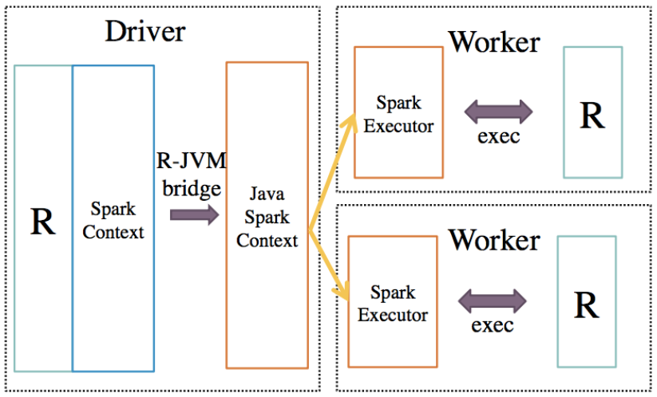
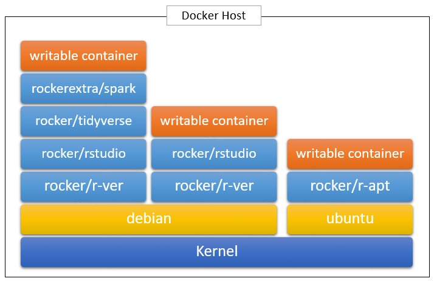
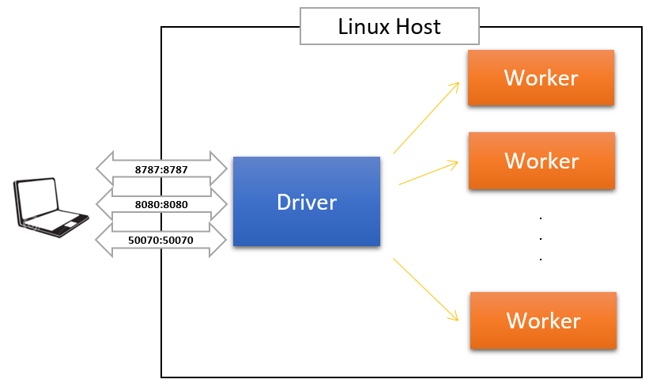

# Intro to Spark

  
   
  Source: <a href="https://databricks.com/spark/about">Apache Spark Ecosystem</a>

- [Apache Spark™](https://spark.apache.org/) is a fast and general engine for large-scale data processing
    + built around speed, ease of use, scalable, fault tolerant ...
- Main focus is Spark SQL, DataFrame and MLlib

# Intro to SparkR

  
   
  Source: <a href="https://people.csail.mit.edu/matei/papers/2016/sigmod_sparkr.pdf">SparkR: Scaling R Programs with Spark
</a>

- Central component of _SparkR_ is a distributed data frame implemented on top of Spark
    + SparkR DataFrames scale to large datasets using Spark's execution engine and relational query optimizer
- R to JVM binding on the driver allows R programs to submit jobs to a Spark cluster and support for running R on the Spark executors (workers)

# Intro to Docker / Rocker

- to do

# Intro to development environment

- to do